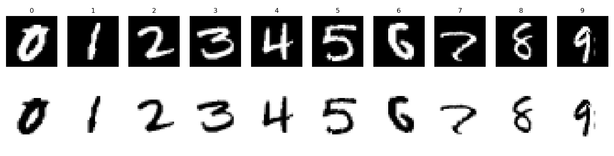

# Adversarial Utils

Utils to make adversarial experiments (classification task) easier, including natural training and testing, adversarial training and testing, visualizing.

## Getting Started

Download this repository as a python package.

## Features

- Use *[tqdm](https://github.com/tqdm/tqdm)* bar as time monitor.
- Use [dataclass](https://docs.python.org/3/library/dataclasses.html) to wrap hyper-parameters. (`dataclasses` is new in Python 3.7)
- Use type hint. (To be completed)

### Prerequisites

```
python >= 3.7
numpy == 1.19.2
torch == 1.7.0
torchvision == 0.8.1
matplotlib == 3.3.2
tqdm == 4.51.0
```

## How to Use

### Prepare dataset

*Adv-utils* use `torchvision.datasets` to load data. The default data directory is `~/torchvision_dataset`. You can change the variable `config.data_info.dir_dataset` for your own path.

The structure in the data directory should be like this:

```shell
├── cifar-10-batches-py
│   ├── batches.meta
│   ├── data_batch_1
│   ├── data_batch_2
│   ├── data_batch_3
│   ├── data_batch_4
│   ├── data_batch_5
│   ├── readme.html
│   └── test_batch
├── ILSVRC2012
│   ├── meta.bin
│   ├── train
│   └── val
├── MNIST
│   ├── processed
│   └── raw
├── ...
```

### Run the demo

#### Train / Validation / Test

- Natural: `demo/train.py`
- Adversarial: `demo/train_adv.py`

#### Visualize

- Show some samples and do processing:  `demo/vis_negative_samples.py`

  

- todo: Add more demos.
## Acknowledgments

MadryLab - [robustness](https://github.com/MadryLab/robustness)

